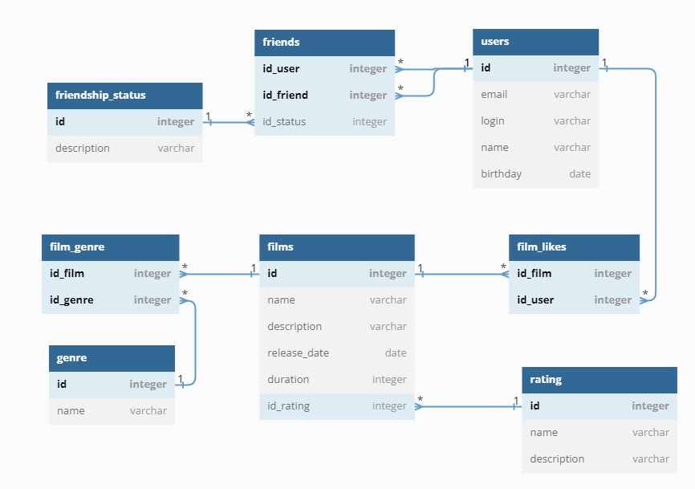

# java-filmorate
Ниже представлена схема БД к проекту FilmoRate. БД состоит из 2 основных таблиц (Users и Films) и нескольких дополнительных таблиц, которые устанавливают связь между основными таблицами или являются вспомогательными для нормализации БД.

[Схема БД к проекту Filmorate.](https://dbdiagram.io/d/647e2d0f722eb774946f1251)

Примеры запросов для основных операций:
1) Получить все фильмы без возрастных ограничений

   SELECT f.name, f.description, f.release_date, f.duration, r.name, r.description
  
   FROM films as f
  
   JOIN rating AS r ON f.id_rating = r.id
  
   WHERE r.name = 'G';
  

2) Получить все драмы

   SELECT f.name, f.description, f.release_date, f.duration, g.name
  
   FROM films as f
  
   JOIN film_genre AS fg ON f.id = fg.id_film
  
   JOIN genre AS g ON fg.id_genre = g.id
  
   WHERE g.name = 'Драма';
  
  
3) Получить все фильмы, понравившиеся пользователю Ивану

   SELECT f.name, f.description, f.release_date, f.duration, u.name
  
   FROM films as f
  
   JOIN film_likes AS fl ON f.id = fl.id_film
  
   JOIN users AS u ON fl.id_user = u.id
  
   WHERE u.name = 'Иван';
  
  
4) Получить всех подтвержденных друзей Ивана

   SELECT u.name AS user, uf.name AS friend_name
  
   FROM users AS u
  
   JOIN friends AS f ON u.id = f.id_user
  
   JOIN users AS uf ON f.id_friend = uf.id
                      
   WHERE u.name = 'Иван'
   
     AND f.is_approve = true;
